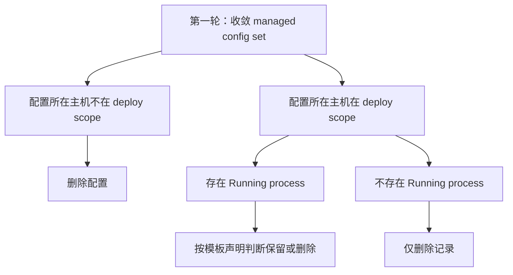
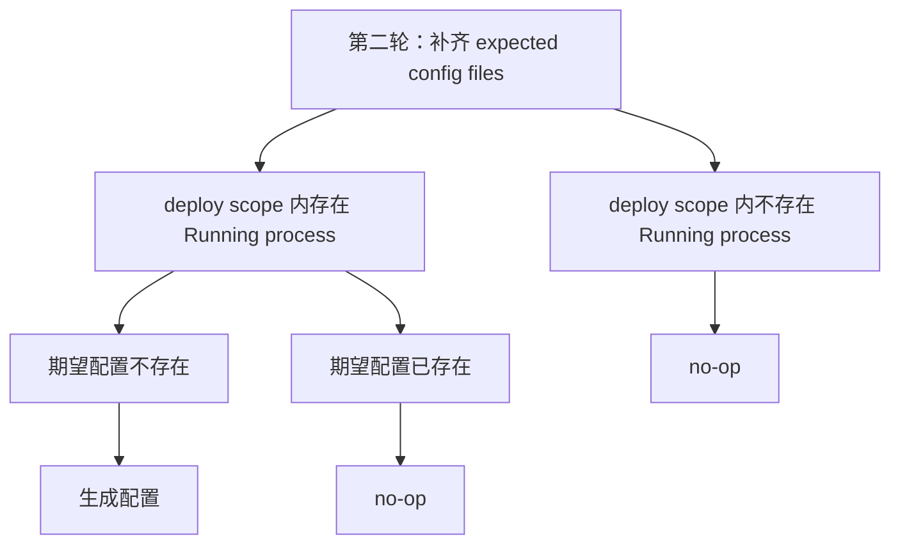

# Decision Tree Doc

## Overview

Use this skill to turn complex rules into a documentation artifact: a clear decision-tree section with aligned prose, Mermaid, rule tables, and validation notes.

This skill is for special documentation-clarification work. It is not a general thinking framework for everyday engineering decisions.

## When to Use

Use this skill when the user asks for any of these documentation tasks:

- write or repair a decision-tree document, rule tree, policy tree, or Mermaid decision tree
- explain complex boundary behavior in a concept doc, design doc, README, or integration doc
- document desired-state reconciliation such as delete/retain/generate/update behavior
- split confusing rules into multiple documentation rounds or trees
- review a decision tree that may have overlapping branches or mixed concerns

If the user gives a clear target file path, edit the file directly. If no path is given, draft the section first.

## When Not to Use

Do not use this skill for ordinary engineering decisions, code design, architecture tradeoffs, or product decisions. Use it only when the output is a documentation-oriented decision tree.

Do not replace a code-review, architecture-review, API-doc, or general Mermaid-diagram skill with this one. This skill only owns decision-tree document modeling quality.

## Workflow

1. Decide whether the task is documentation-oriented decision-tree work.
2. If editing a repository document, find one or two same-directory or same-type local docs with Mermaid decision trees and match their style.
3. Collect facts from the repo, source docs, code, or pasted material. Ask the user only for decisions, not facts you can retrieve.
4. Identify the decision objects, purposes, and rounds before drawing Mermaid.
5. Draw one `graph TD` classification tree per round unless the user explicitly asks for a workflow/activity diagram.
6. Synchronize the surrounding prose, decision inputs, rule table, result semantics, and validation notes.
7. Run semantic self-review and Mermaid syntax validation when possible.

Use frontier-style questioning only for complex boundary docs where unresolved decisions change the tree shape.

## Modeling Rules

- Same-parent sibling nodes must be mutually exclusive. If siblings overlap, split the parent into another classification level.
- Different decision objects, decision purposes, execution rounds, or reader questions should become separate trees.
- Model the rule, not the implementation call sequence.
- Keep each tree about one question the reader needs answered.
- Prefer explicit outputs such as delete, retain, generate, update, no-op, unsupported, or not applicable.

## Mermaid Style

Default to the plain classification-tree style used by compact concept docs:

- use `graph TD`
- use rectangular nodes with quoted labels
- use declarative condition phrases, not question phrases
- avoid `Start` and `Done` nodes
- avoid diamond decision nodes like `{...}`
- avoid `yes/no` or `是/否` edge labels
- avoid `subgraph` grouping
- avoid `classDef` styling

Relax these defaults only when local documentation examples or the user explicitly require workflow/activity diagram style.

## Output Structure

For a full decision-tree doc section, include:

- target semantics: what the rule set is trying to settle
- decision inputs: objects, states, scopes, and sets used by the rules
- decision rounds: why there is one tree or multiple trees
- Mermaid decision tree: one `graph TD` tree per round
- boundary rules table: use columns `轮次 / 场景 / 决策`
- result semantics: the final expected state or observable behavior
- validation record: semantic review result and Mermaid syntax validation result

Trim this structure for small docs, but do not drop the tree, rule table, or validation status when the behavior is complex.

## Review Mode

When reviewing an existing decision tree, report findings first:

- overlapping sibling branches
- mixed decision objects, purposes, or rounds in one tree
- workflow steps presented as a decision tree
- question-style nodes that hide branch categories
- prose, table, and diagram mismatch
- missing validation or unverifiable Mermaid syntax

After findings, provide the smallest repair that makes the document structurally correct.

## Repair Mode

Use minimal repair when the tree's object, purpose, and round boundaries are already correct.

Redraw the tree when the current diagram mixes decision objects, combines multiple rounds, or has non-disjoint siblings. A local patch to a structurally wrong tree usually preserves the confusion.

## Validation

Semantic self-review is required:

- each same-parent sibling set is disjoint
- each tree has one object and one purpose
- multi-round behavior is split into one tree per round
- Mermaid, prose, and rule table say the same thing
- the tree is a classification tree unless workflow style was explicitly requested

Mermaid syntax validation is required when tooling is available. If validation cannot run, state `Mermaid syntax not validated` and give the reason.

## Example: Split Mixed Desired-State Trees

Bad shape: one Mermaid tree starts with `managed config set`, checks whether existing configs should be deleted, then continues into generating missing `expected config files`. The tree mixes cleanup and ensure behavior, so sibling branches are hard to prove disjoint.

Better shape:

This split works because each round has one object and one purpose: the first reconciles current managed records, and the second ensures missing desired files.

## Common Mistakes

| Mistake                                                                                                               | Fix                                                |
| --------------------------------------------------------------------------------------------------------------------- | -------------------------------------------------- |
| Drawing a workflow with `Start`, `Done`, and yes/no labels when the doc needs a classification tree                   | Use `graph TD` and condition nodes                 |
| Putting delete cleanup and desired-state generation in one tree                                                       | Split by decision round                            |
| Making sibling branches overlap, such as `not in scope` and `not running` under the same parent when both can be true | Add an earlier partition level                     |
| Letting Mermaid render success stand in for correctness                                                               | Run semantic self-review too                       |
| Asking the user for facts available in the repo                                                                       | Retrieve facts yourself and ask only for decisions |

## Final Checklist

- [ ] The task is documentation-oriented decision-tree work.
- [ ] Local documentation style was checked when editing a repo file.
- [ ] Same-parent siblings are mutually exclusive.
- [ ] Different objects, purposes, or rounds are split into separate trees.
- [ ] Nodes use declarative condition phrases.
- [ ] Rule table uses `轮次 / 场景 / 决策` when rules are complex.
- [ ] Prose, table, and Mermaid agree.
- [ ] Mermaid syntax is validated, or the response states why it was not validated.

## Related Skills

- Use `design-doc-mermaid` for general Mermaid syntax, image export, and diagram validation workflows.
- Use `readme-logic-first` for bk-nodemgr logic-first document structure beyond decision-tree modeling.
- Use `grilling` for full design-tree interviews; this skill only borrows frontier rounds for complex documentation clarification.
